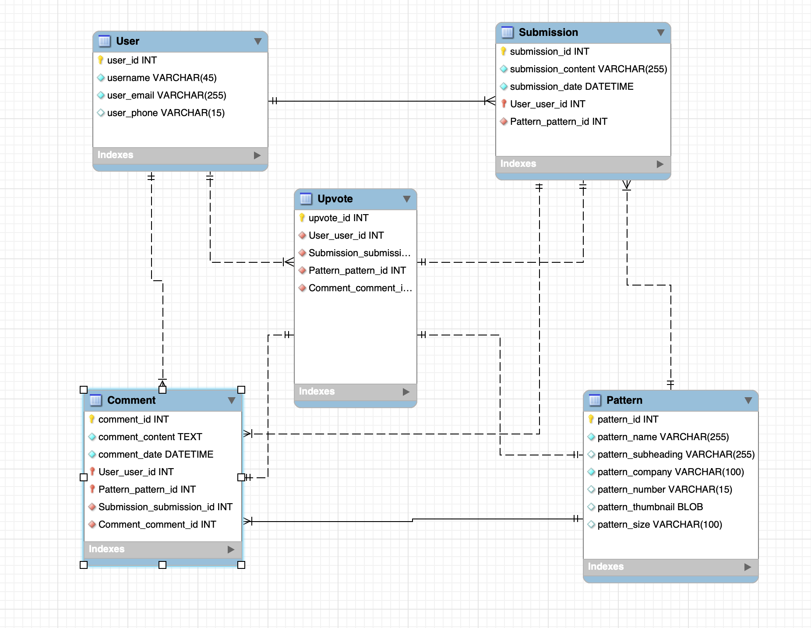

# Database Design for Vintage Patterns and their Corrections

Many modern reprints of vintage patterns are not faithful reproductions. Sewists are discovering the discrepancies between the old and new patterns through trial and error. Since the originals are usually not available, the only recourse a sewist has is to look for another's corrections, or to correct the reproduction themselves. This database concept attempts to link new corrections with reprinted patterns. It provides a mechanism for users to upvote content so that the good reproductions rise to the top, and the good corrections rise to the top.

The EER is designed around Users, their submissions (of content and comments), and their relationship with both the content they add and that content in reference to pre-existing sewing patterns. The most important data exists in the table relationships happening between the User tables and the Pattern tables. Without the connecting categories (comments, submissions), there would be no point for storing User or Pattern data. 

## Technologies Used 

